有关“什么是工作流”和工作流的概念，就不在这里介绍了。大家有兴趣的可以到 WFMC 上看看。 
这里先说说个人的看法：一个工作流包括一组任务（Task ）及它们的相互顺序关系，还包括流程及任务的 
启动和终止条件，以及对每个任务的描述。 
其实，现在已经跳出了单工作流的圈子，越来越倾向于多工作流之间的嵌套或整合，在本文后面的第 
4 、5 节会简要的介绍。

　　在进入各个模型说明前，需要说明一些有关本篇文章中，出现的一些图形含义。既然然流程图，就免不了 
用图形表示，用图标代替一些流程节点的含义。如下图所示：
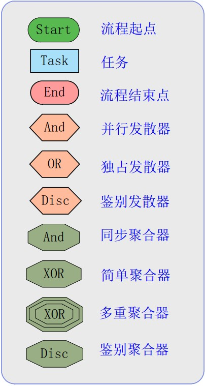

#一、流程的起点模型
  任何事物都有由头有尾，一个流程也不例外，那么现在我们就从流程的“头”——流程起点说起。 
首先，需要说明的是，起点也是一种任务节点（Task Node ）。

###1.1 单起点（Single Start Node）
　单起点估计大家都比较容易理解，现实中工作流应用的也是最为普遍。如下图（1-1）所示，其就是单 
起点的模型。在接下来的所有图像中，一个绿色方框代表一个起点。

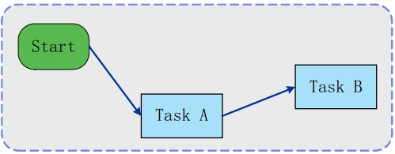

##1.2 多起点
　　多起点的工作流，在现实应用多不是太多。其主要表达的是，在同一流程中，存在多个起点。说到这 
里，有必要重新申明一下：起点也是一种任务节点，也就说起点不是独立于工作流任务的，在流程启动的 
时候，其也需要完成某种特定的任务，以激活整个工作流的运转。 
　　多起点的工作流模型，基本上有如下三种方式。

###多起点方式一
　　请参考图（1-2），起点A 和起点B ，它们都可以激活流程的运行，而且激活后，流程都会共同指向Task 
A 。所以，对于Task B 来说，其不关心流程是如何激活的，其只关系从Task A 是否正确的传递来正确的流 
程数据。

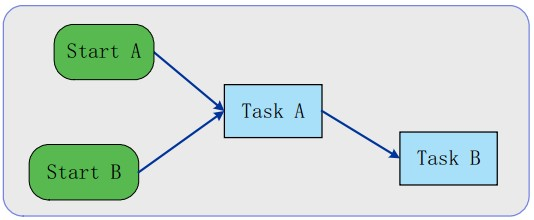

###多起点方式二
　　在方式二（如下图（1-3））中，起点A 激活工作流后，导致流程沿着Task A——Task B——Task C 方 
向流转。而从起点B 激活工作流后，Task A 则被跳过。 
　　这种方式，在现实中是极为少见的。如果将Start B——Task B 这条流程段 与 Start A——Task B 这条 
流程段，分开来看。则可以近似看作的两个“子流程”的选择性汇总（两选一，或多选一）的情况。

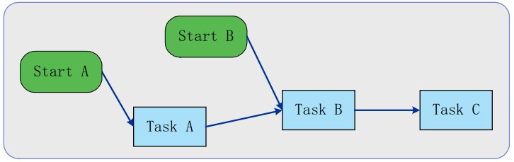

###多起点方式三
　　方式三（如下图（1-4）），虽然也存在多个起点，但是基本是按照一个统一流程方向运行的。这是与方 
式二最大的区别所在。在此，须要再此申明：一个起点（Start Node）同时也是一个任务节点（Task Node ）。 
参看图中的Task B/Start B 节点。 
　　此种方式，在现实中，还是有一定应用性的。特别是在多个流程之间信息交互的时候，流程A 发送消 
息数据，激活流程B 的运行。但是未必是从流程B 的默认激活点激活，可能是从流程B 的中途某个任务 
激活。比如图中的Task B/Start B 任务节点（同时也时流程起点）

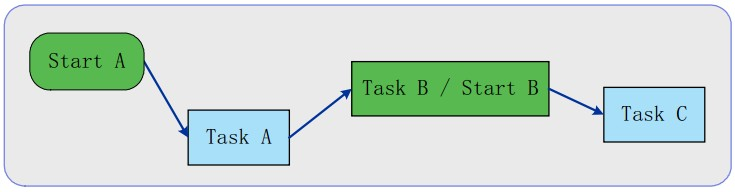

#二、流程的激活模型
　　上面我们看了工作流的起点模型。也知道任何流程，都必须有起点，或者相对的起点。一个流程被激 
活后，会从起点开始沿着预定的流程路线，有序或无序的往下进行（注意，我这里提到了“无序”二字， 
我将在后续讲解“无序”状态）。 
　　所以，起点就是这个流程被激活的源头。下面让我们来看看，一个流程被激活的方式，或者说一个起 
点，被激活的方式： 
　　从起点的激活方式，有如下两种方式：

##2.1 人工激活
　　大多数的流程激活，都是因为人为的信息数据输入或产生。比如一个订单处理流程，客户提交了订单 
信息（订单信息数据产生），则激活了订单处理流程的开始。

##2.2 定时或限时激活
　　在一个特定的时间，因为特定的情况，符合特定的条件，激活某个特定的流程（或任务）。 
　　这种激活方式，在现实中很少单独出现，大多数情况，都因为在某一个流程中，因为在限定的时间内， 
因某项任务未达到预期的状态，而激活另外的任务或新的处理流程。也就说，这种方式，是受外来因素影 
响的，而且大多与一些流程任务（或流程模式）一起出现。 
　　举个定时激活的实例：比如，订单处理流程，限定5 天内发货，那么定义在第三天的时候，如果没有 
接到发货通知，则激活一个催办信息（催办任务）。这样流程系统，会在第三天的时候自动发出催办信息。

##2.3 外界消息激活
　　这种方式，大多是在多流程信息交互（或大小流程嵌套）应用中。现在比较流行的业务流程整合/管理 
（BPM ），基本上都涉及到这方面内容。 
　　如下图所示，流程 A ，在结束的时候（在以下的所有图中，将采用红色框图，表示结束节点），会向 
流程 B 发送 Message ，以激活流程 B 的运行。至于这个消息是 Soap 消息，还是通过消息中间件转发的 
Message ，这就是不同的应用方式了。 
　　一般现实应用中，都需要考虑JMS 或WebService 的应用接口。从个人目前所实施过的工作流应用来 
说，大多还是采用Message Query 方式居多。虽然软件的发展，逐渐SOA （面向服务）化，但是WebService 
的安全性或数据正确性，还有待进一步的发展，从这一方面说，比起消息中间件的高度安全性和消息正确 
性，WebService 目前还是稍逊一筹。其实，安全性和信息正确性，是很多应用客户非常关心的焦点。 
　　但是，SOA 化的发展是未来的趋势。所以现在大多的应用都会提供JMS 和WebService 接口，或其他 
类似接口。

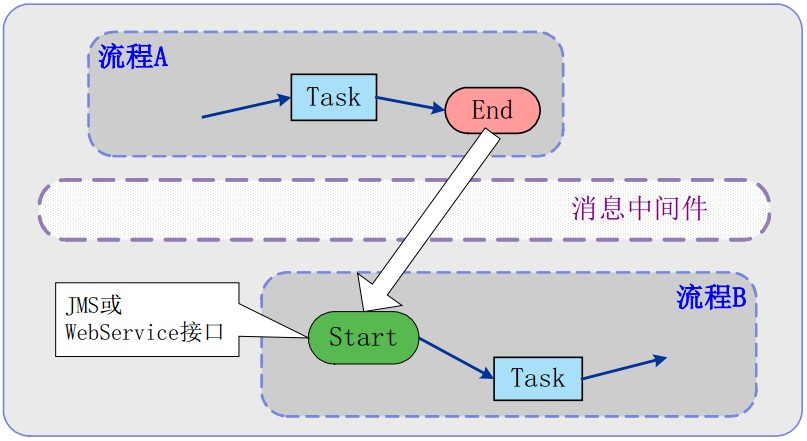

#三、流程的运转模型
这里将是本文最为核心的地方了，什么是工作流，也将在其运转模型中体现。 
任何事物都是循序渐进的，由简单到复杂。我们先来看看最为基本的集中运转模型

##3.1 基本运转模型
串行（Sequence ）
　　串行，是最为简单，也最为容易理解的模型。按照预定的任务列表（Task A,Task B,Task C ），有序的执 
行，如下图（3-1 ）所示。

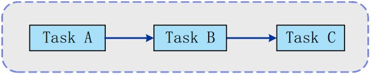

自循环
　　自循环的模型，主要用于表示：同一个任务节点，重复的执行多次。

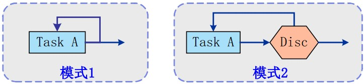 

　如图中所显示。“模式2 ”比“模式1”多了一个鉴别节点（Discriminator Node）。这两种模式，在现 
实中应用的都较为广泛，其中“模式 1”更多的偏向人为的选择，也就是说，在任务执行后，由人为的决 
定是否继续重复的执行这次任务；而“模式 2 ”则更多的倾向于一个既定的规则，按照原有的规则，决定 
是否重复执行。

##3.2 发散运转模型
并行（Parallel ）
　　并行，就涉及到流程的分支概念。就是说在流程运行过程中，因为不同的条件或情况，或者处理的业 
务需要多部门（多任务）分开处理，而产生了流程分支。如下图所示

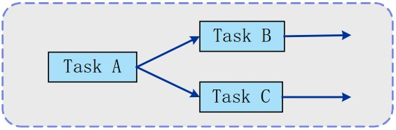
流程在执行完任务A 后，因为需要，产生了两个并发执行的分支（A——B 和A——C ）。这两个分支 
之间是对等的，也是并行执行的。 
　　有关上面的流程图，可能在以后的一些文章/文档中，大家会看到下面类似的图形

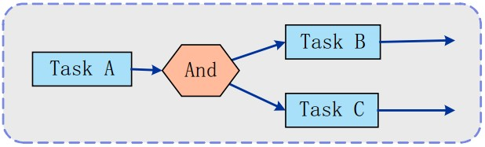

虽然比上图多了一个And 选择器，但实际上，两图，表示的是同一个含义或模型。所以大家在应用或 
读书的时候，可以长个心眼哦，自己学会实质性的分析。

###独占式选择（Exclusive Choice ）
　　当一个任务处理完后，发现其后面可允许走多个分支流程，但只允许选择其中某一个分支运行。这个 
选择是人为决策的，预先没有设点选择的规则。

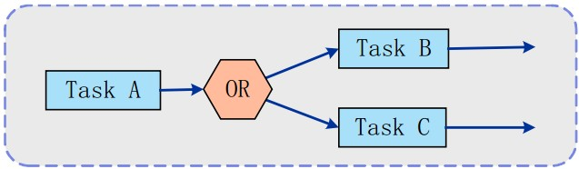

###鉴别式选择（Discriminator Choice ）
　　这同前面的“独占式选择”很相似，唯一不同点，就是多了一个鉴别器（Discriminator ）。当任务达到 
这个鉴别器的时候，鉴别器会根据当前流程所处的状态，对比预先设定的一些选择规则，自动判别接下来 
流程的流向，也就是自动根据条件，选择一个满足条件的分支运行。

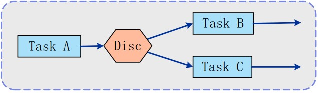

###鉴别器模式（有的可能叫选择器等等名字，表达的意思基本相同），在现实应用中较为广泛。比如在 
订单申请流程中，设定一个依据数额判别流向的鉴别器，如果数额大于等于 5000 就走分支流程 A ，如果 
数额小于5000 就走分支流程B 。

###抄送模型
　　抄送模型，本身不是一个标准的工作流运转模型，但是在现实应用中，比比皆是。 
　　它表达的意思是（请参考下图），存在主流程（A——C ），在一个任务（A ）执行完毕后，会继续执行 
主流程上下一个预定任务（C ），但是同时也会激活另一任务（B ）（或另外的流程）的执行，但是任务B 
以及任务B 的后续流程，不会对主流程运转造成影响。 
　　请注意图中的 A——B 流程沿线，用的是灰色虚线表示，而且任务B 也同样采用灰色表示。

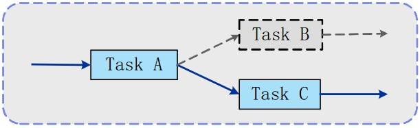

来个举个电子办公系统中，经常遇到得例子说明一下：比如一个发文，在交司局会签的时候，可能会 
抄送一份给另外的司局备案，这个过程就或额外的激活一个不影响主会签流程的“抄送任务”，比如图中 
Task B 。

###发散模型
　　说到这里，大家可再回过头参看一下并行模型（3.2.1 节）。发散和并行最大的区别就是，各个分支 
（branch）的流程状态（或流程数据）： 
　　在并行模型中，分支状态（A-B ）与分支状态（A-C ）是大多数情况下是不相等的。由任务A 执行后 
的状态进行一定条件下的“拆分”，形成了两个分支（或多个分支）流程。这多个分支流程，在最终需要 
重新聚合成一个主流程，以确保流程信息的完整性（当然，实际运行中，可能存在因为超时等特定原因而 
最终抛弃某个子流程）。 
　　而在发散模型中，分支状态（A-B ）与分支状态（A-C ）是绝对相等的。因发散而产生的多个分支流 
程，在最终未必聚合（可能因为种种原因，聚合的时候会抛弃一个和多个分支流程）。 
这里面说到了“聚合”概念，在后续的介绍上，将加以详细叙述

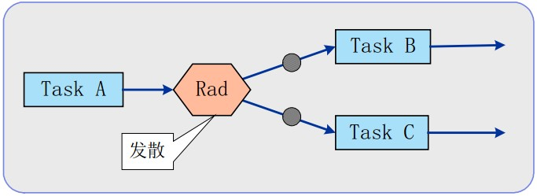

##3.3 聚合运转模型
　　下面我们就将进入聚合模型的介绍。因为有了“发散”，在一个流程的后续运转中，才会出现“聚合” 
这个问题。所以在后续讨论聚合模型的时候，大多情况下都会结合上面的发散运转模型。

###同步聚合（synchronize merge ）
　　由必要说明一下，同步聚合，可不是“同时聚合”噢。

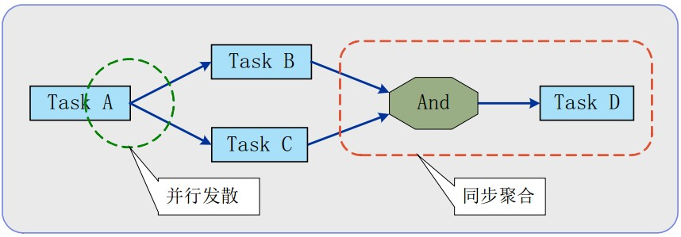

###简单聚合（Simple Merge ）
　　虽然名为简单聚合，不过在现实应用中，其理解度和应用度，都基本上比上面的“同步聚合”要难。 
　　多分支在聚合的时候，采用类似于“先进先出”法则，哪一个分支先达到，则最先激活流程的运行。 
　　后续的分支则到此就会终止。

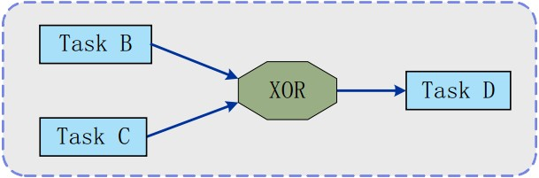

###多重聚合（Multiple Merge ）
多重聚合，与上面的简单聚合有些相似。但是比起Simple Merge 可就复杂多了。到目前为止，在现实 
中，我还没有碰到过这样的流程实施。 
　　多分支在聚合的时候，采用类似于“先进先出”法则，但是不同于简单聚合的是，任何一个分支， 
在到达这个聚会点的时候，均会激活后续流程的运转。 
　　这就涉及到一个问题了，如果一个后续流程实例刚刚被激活，又一个分支到达，那么这个分支是 
否激活后续流程实例呢？在不同的工作流引擎中（workflow enginner ）中会有不同的解决方案，有的选择 
立即激活，有的选择等待延迟激活。就这一点来说，不是本文的讨论主题，有兴趣的朋友，可以在自己的 
引擎中实现不同的方式。

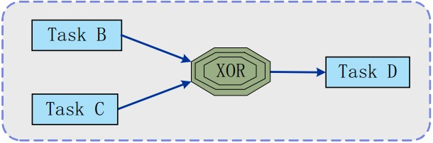

###鉴别式聚合（Discriminator Merge ）
　　这个是较为容易理解的，显示应用中也常常碰到，但是在应用的实施难度较大，因为一般与其配合的 
都会存在一个“规则引擎”，来定义/处理聚合规则

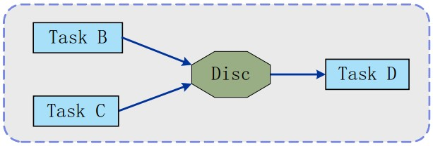

#四、流程组合嵌套模型
　　一直到现在，所说的模型，都是定位在“任务之间的关系”。不论前面的发散运转模型，还是聚合运 
转模型，都只是流程内部的任务关系，而不涉及到流程与流程之间的关系。 
　　请参看下图，虽然任务很复杂，但是所有的任务都限定在同一个流程中，而且为了巩固前面的一些运 
转模型概念，我特意在里面包含了并行，发散，自循环，鉴别聚合，同步聚合等模型。

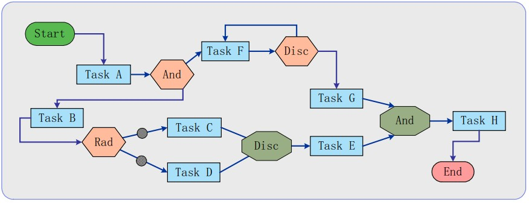

让我们再来看看下面的流程，看起来比上面的流程简单，其实不是。仔细的看，其实这里面有两个流 
程在运行，一个主流程内嵌一个子流程.
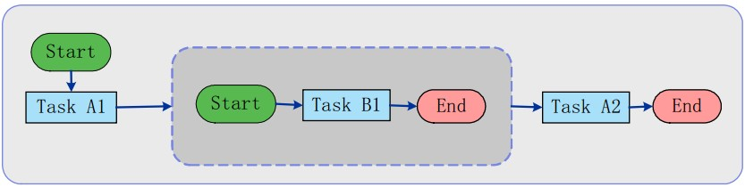

接下来，就来看看流程与流程之间会存在什么样的关系，存在什么可能的模型。

##4.1 内嵌模型
　　内嵌模型刚刚已经提到了，就是在一个主流程中，内嵌了一个或多个子流程。每个子流程自身可能是 
可独立运转的；也有可能是主流程的辅助性子流程，不可独立运行。

###主流程等待方式
　　请参考下图，在主流程运行到“Router”位置的时候，会激活一个子流程的运行；在子流程运行完后， 
会重新运行到主流程的“Router”位置，继续主流程的运行。

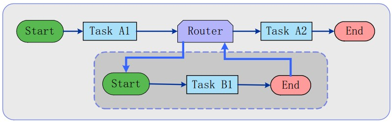

在这种方式下，当子流程运行的时候，主流程会暂停，等待子流程的完结。

###主流程也运行方式
　　比较下面的图与4.1.1 节的图，就会发现很大的不同。 
　　与“主流程”相同的是，当主流程运行到“Router”位置的时候，会激活一个子流程的运行。但是， 
激活子流程后，主流程并没有停止，而是基于按照预定的流程方向运行；同时，激活后的子流程也同样处 
于软转状态。 
　　说到这里，估计很多让都会询问，那么子流程的信息什么时候返回呢？虽然在下图中，表示为子流程 
的信息返回到主流程的“任务A3 ”。但是，依然涉及到很多问题，比如：什么时候聚合，怎么聚合的问题 
了；而且主流程和子流程的运行时间未必搭配恰当，有可能存在主流程首先运行到Task A3 点，而这时候 
子流程还没有运行结束情况，反之亦然。 
　　这种情况，大多数采用“同步聚合”的方式：如果有一方未到达的情况下，另一方会等待。当然，这 
其中可能涉及到等待超时等不良因素，这时候主流程时选择继续等待，还是发催办消息，还是继续运行， 
就是工作流引擎的设计问题了。

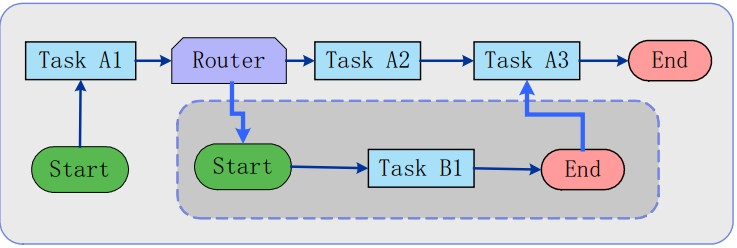

##4.2 外嵌模型
　　与内嵌模型不同的地方，就是外嵌的子流程，不返回主流程。在主流程激活子流程后，主流程继续运 
行，且不关心子流程的运行状态或运行结果。 
参考下图，你会发现其与内嵌模型中的“主流程也运行方式”非常的相似，区别就是，子流程最终没 
有返回到主流程。

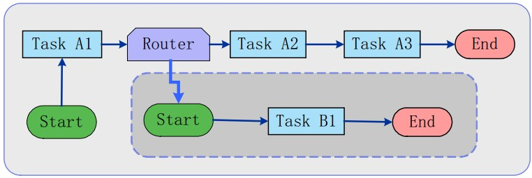

#五、流程整合模型
　　流程整合的模型，已经超越了“流程运转模型”的概念范畴。但是作为目前“系统整合”的一个比较 
流行的趋势，拿到这里顺便提一下。 
　　现在的业务越来越复杂，跨区域，跨部门之间信息交互方式的需要越来越明显，而且跨区域，跨部门 
之间业务配合也越来越多。从信息整合的发展来看，“面向应用的数据层整合”和“面向服务的接口层整 
合”都逐渐走向“BMP”模式：由中央主流程控制多个子流程（分布在不同地域或不同部门，各自独立的 
流程）协同运行，以达到整个业务逻辑的运行。

　　其实在第二章“流程的激活模型”的“外界消息激活”模型中，我已经简单提到了一些，只是不太明 
确。那么现在让我们来看看一个普通的“流程整合”大概是什么样子的，请参看下图。 
　　实际的整合要比这张图上的复杂很多，也许还会有一些JMS/WebService 等的信息交换接口，可能用 
到不同厂家的数据交换平台，或消息中间件等等；当然那些安全措施也必不可少了。 
　　简单的整合模型，基本上都是采用“主流程控制”的方式：由一个主流程控制整个流程的运行，由各

个子流程具体完成某项任务，并向主流程返回处理结果。主流程在确定子流程正确运行/处理完后，并得 
到处理完的信息后，会继续按照预定的流程路线，激活另一个子流程。 
　　在有的流程整合设计中，主流程本身不完成任何任务（只负责运转控制）；而有的设计中，主流程本 
身自己也需要完成一些任务。

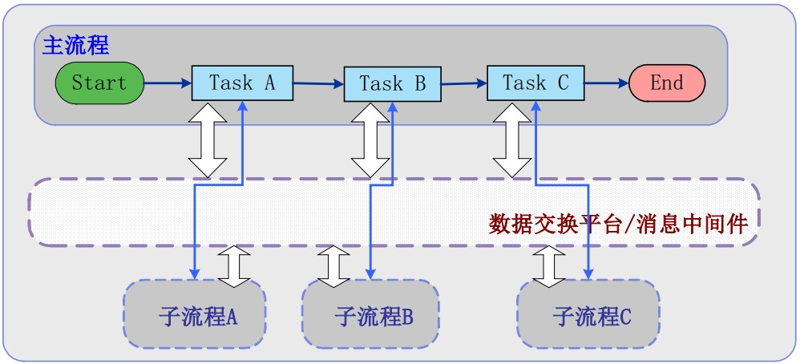

到此，有关流程的运转模型，基本上就完结了。现实中，可能存在的模型要比这些“图形”要复杂很 
多，也会考虑很多因素（组织模型，安全，信息文档等等）。考虑的因素越多，涉及的流程复杂度越高， 
对工作流引擎的要求就越高。实际上，一个非常通用的工作流引擎是很难存在的。因为一个工作流引擎不 
仅需要解析预定的流程，而且还需要控制维护流程运转中的数据信息（很多业务数据是有很强的领域性）， 
所以大多的工作流引擎都是定位在某一方向上，以解决某一类问题为主。

　　希望以上的文字，能够让大家了解通用的一些流程运转模型。真正在使用中，还需要大家自己去摸索， 
去积累了。
